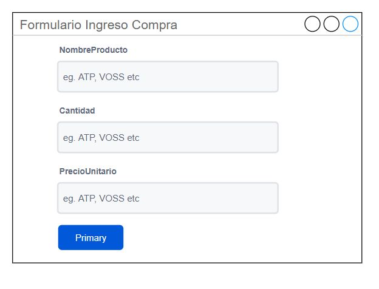

# junio16


# En el package management

```c#
Install-Package Microsoft.EntityFrameworkCore.Relational -Version 6.0.0-preview.4.21253.1
Install-Package Microsoft.EntityFrameworkCore.SqlServer -Version 6.0.0-preview.4.21253.1
Install-Package Microsoft.EntityFrameworkCore.Tools -Version 6.0.0-preview.4.21253.1
```

# En el package management, ejecutar el scaffold

```c#
// usar este
Scaffold-DbContext "Data Source=(local)\sqlexpress;Initial Catalog=Sakila;Integrated Security=True" Microsoft.EntityFrameworkCore.SqlServer -OutputDir Models 
// o este
Scaffold-DbContext "Data Source=(local)\sqlexpress;Initial Catalog=Base9Junio;Integrated Security=True" Microsoft.EntityFrameworkCore.SqlServer -OutputDir Models  -table Comentarios -dataannotations -force
```

# Ejercicio

Necesitamos crear un sisterma para ingresar y listar compras. Para ello, cree lo siguiente.

* Tabla: **Compras**
  * IdCompra (identidad, entero y llave primaria)
  * NombreProducto (texto)
  * Cantidad (entero)
  * PrecioUnitario (Entero)

Luego, cree un proyecto que haga lo siguiente

* Configure el proyecto (**startups.cs**) para que pueda usar MVC Controller.
* Agregue el Entity framework que incluya la tabla Compras.
* Cree un **CompraRepo** con las funciones de **listar** e **insertar** una nueva compra.
* Cree un controlador de Compras (**CompraController**) con 3 acciones:
  * **Listar**
  * **Insertar**(post y get)
* Cree las vistas correspondientes para cada accion del controladr
  * .  Para el listar puede usar [HTML Tables generator – TablesGenerator.com](https://www.tablesgenerator.com/html_tables)



